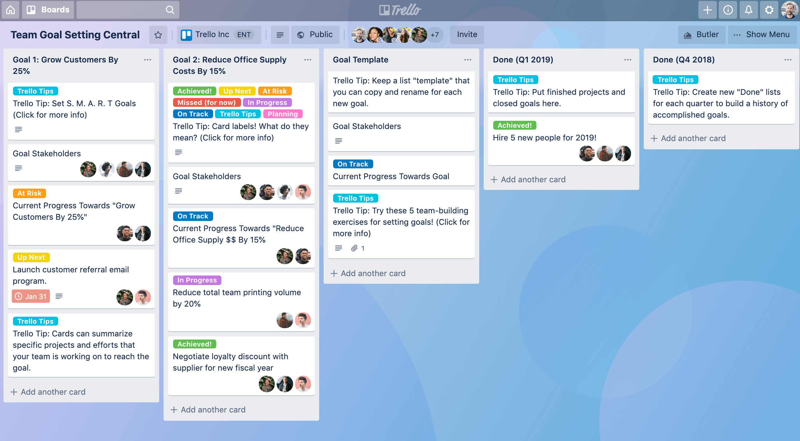

# Semana 6

# Tarjetas de TRELLO

Esta semana creamos un área de trabajo personalizable, para poder asignar trabajos, tareas, objetivos y recursos de manera organizada en un espacion online compartido con todo el equipo.

Para esto utilizamos la aplicación TRELLO?, la cual nos permite hacer todo lo anterior de forma sencillas y simple.

# Ventajas de usar TRELLO

**Visualizar el progreso:** Las tarjetas se mueven entre columnas tipo “Por hacer → En proceso → Hecho”, lo que te permite ver el avance del proyecto de un vistazo.Es muy útil para detectar bloqueos (por ejemplo, tareas que llevan demasiado tiempo en “En proceso”).

**Gestión de tiempo y prioridades:** Puedes poner fechas límite o etiquetas (“Alta prioridad”, “Investigación”, “Diseño”) y así concentrarte en lo más urgente o importante.

**Documentación del proyecto:**  Cada tarjeta puede tener notas, enlaces, imágenes o archivos, así que sirve como registro del trabajo.Esto es muy útil cuando tienes que presentar el proyecto o explicar cómo fue evolucionando.

# Costos de producción (costos de materiales)

Para poder crear el prototipo necesitamos varios materiales, por lo mismo es imperativo encontrar los mejores precios que permitan mantener un costo de producción mínimo, ayudando así también a impulsar las ganancias del producto.Debido a lo mencionado nosotros investigamos en diferentes sitios web, desde empresas grandes (Mercado libre, Amazon) a locales pequeños (tiendas de electronica locales) para poder encontrar los mejores materiales por el mejor precio, a continuación incluyo la evidencia de dicha investigación.

[Investigacion de costos de arranque](https://iberopuebla.sharepoint.com/:x:/s/Section_13354E-O25/EQ0PryjV_qdLpqjuHYGGcPsBakV0j4IiY0hsXlkxGk67yw?e=R0LIy3)

# Ciclos

En la presentación anterior mencionamos algo llamado "ciclo", para aquellos que no entiendan a que se refiere esto, un ciclo es el equivalente a un intento, refieriéndonos claro a la elaboración de alguna parte del prototipo, por lo que ciclo se refiere a cuantos intentos se requiere para poder alcanzar el objetivo deseado.Esta terminología nos permite hacer un análisis realista de cuanto tiempo, esfuerzo o personal requiere cada fase del proyecto, lo que permite distribuir recursos y tiempo de forma más eficiente.

Al hacer una análisis de ciclos, el conocimiento empírico es sumamente relevante, ya que muchas veces la planeación y teoría son mucho más fáciles que la práctica.