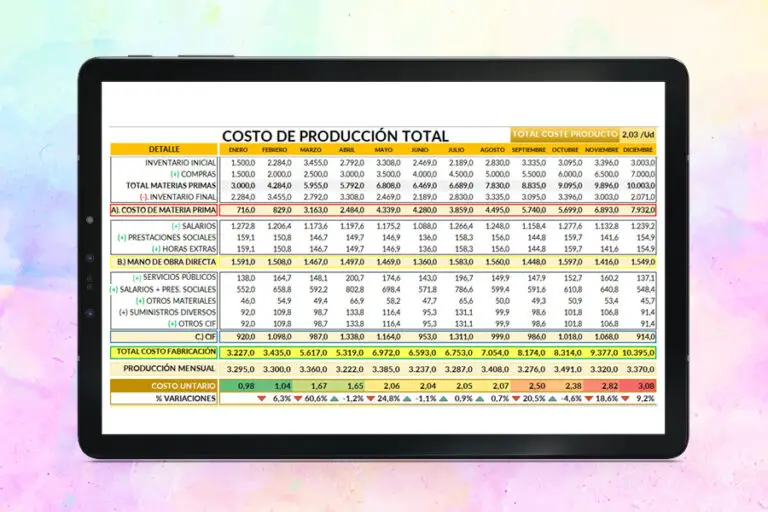

# Semana 7

Hicimos una tabla de costos para nuestro prototipo con el objetivo de tener una visión clara y organizada de los recursos necesarios para su desarrollo desde cero. En ella se desglosan tanto los costos de producción —como materiales, componentes electrónicos, herramientas y mano de obra—, como los costos de distribución que se planean adoptar, incluyendo empaque, transporte y posibles canales de venta. Esta tabla nos permite estimar el presupuesto total, evaluar la viabilidad económica del proyecto y planificar una estrategia de producción sostenible, asegurando que el prototipo no solo sea funcional, sino también accesible y realista para su futura implementación o comercialización.

# Creando la oferta

Al crear la oferta de nuestro producto, es necesario dividir los costos individuales que se requieren para la producción unitaria de dicha prototipo, de manera que se pueda crear un análisis en relación a un año (nosotros elegimos un año) de cuánto costaría la producción de una cantidad determinada del producto terminado.

En este caso, nosotros separamos nuestros costos de manera que se pueda identificar, cuáles son aquellos que diferencian a nuestro producto de los demás.

# Dsitribución del producto

La distribución del producto es ESENCIAL para la creación y venta de una idea, ya que se tiene que considerar ¿a quién? y ¿cómo? vas a hacer llegar tu idea.

A continuación adjunto nuestro [excel](https://iberopuebla.sharepoint.com/:x:/s/Section_13354E-O25/EQ0PryjV_qdLpqjuHYGGcPsBakV0j4IiY0hsXlkxGk67yw?e=R0LIy3).

